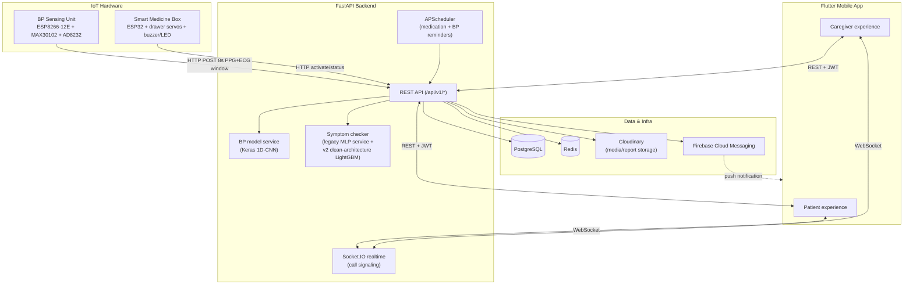
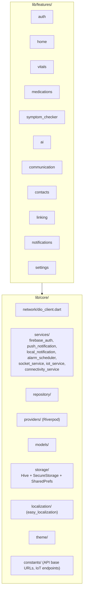
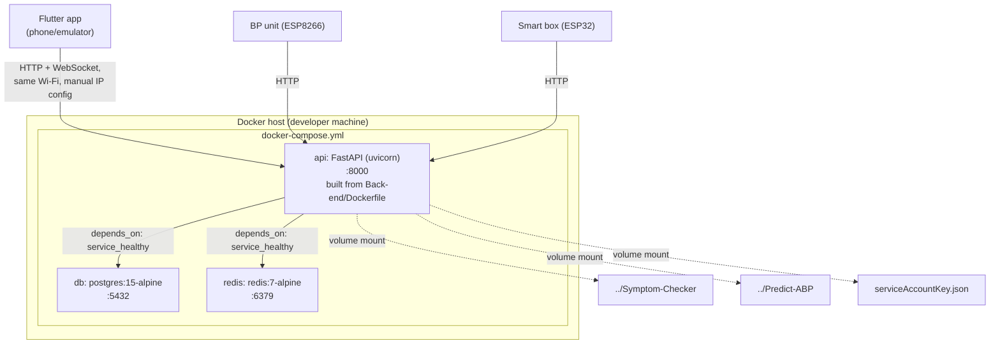
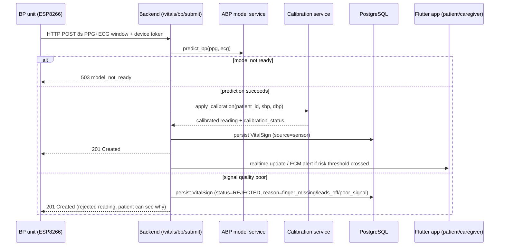
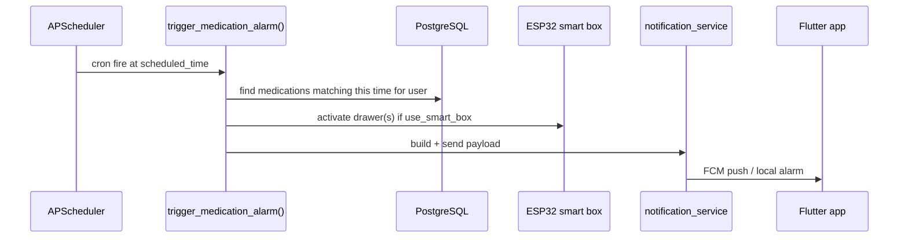

# System Architecture

This document describes how Health Mate is actually put together: the major
components, how they talk to each other, and the architectural decisions that
shape the backend and frontend codebases. It is written from the code as it
exists today, not from the project's earlier planning notes — where the two
disagree (and in a couple of places they do), this document follows the code.

## 1. System overview

Health Mate is a remote patient-monitoring system built around four moving
parts: a Flutter mobile app used by both patients and caregivers, a FastAPI
backend that owns all business logic and state, two purpose-built AI models
(blood pressure estimation and symptom/disease triage), and two independent
pieces of IoT hardware (a blood-pressure sensing unit and a smart medication
box). A managed video/voice calling layer connects patients and caregivers
directly.



The system is deliberately split so that **the hardware never makes clinical
decisions**. Both the BP unit and the smart box are data collectors / actuators
only — the ESP8266 BP firmware (`bp-hardware-code/bp-hardware-code.ino`) only
buffers 800 raw PPG/ECG samples, checks finger/lead gating, and POSTs the
window to the backend; it contains no model, no calibration, and no risk
logic. Every clinically meaningful step — signal validation, model inference
(`abp_prediction_service.py`), calibration (`calibration_service.py`), drift
detection (`bp_drift_service.py`), risk classification, and alerting — runs in
the backend. This is a real, verifiable property of the current code, not
just stated intent.

## 2. Backend architecture

The backend is a FastAPI application (`Back-end/app/main.py`) that mixes two
architectural styles side by side, and it's worth being explicit about that
rather than pretending it's uniform:

### 2.1 Service-layer style (most of the system)

Authentication, medications, vitals, notifications, contacts, calls, IoT
device management, and the BP reminder/calibration/drift logic all follow a
straightforward pattern: FastAPI routers in `app/api/v1/` call into flat
service modules in `app/services/`, which talk directly to SQLAlchemy models
in `app/models/`. There is no repository abstraction or use-case layer here —
routers, services, and ORM models are directly wired together via FastAPI's
`Depends()`. This is simple and easy to trace, and it is the dominant pattern
across most of the codebase.

### 2.2 Clean/hexagonal architecture (symptom checker v2)

The symptom checker's newer implementation is structured differently, as a
deliberate, documented refactor (see the docstring in `app/core/di.py`, which
references it as "Phase 5 Clean Architecture" with a "Phase 6" already
anticipated):

```mermaid
flowchart LR
    subgraph API["app/api/v1/ai.py"]
    end
    subgraph Application["app/application"]
        UC["use_cases/<br/>run_assessment, run_bp_triage,<br/>get_available_symptoms, get_categories,<br/>start_chat_from_assessment"]
        DTO["dto/assessment_dto.py"]
    end
    subgraph Domain["app/domain"]
        ENT["entities/<br/>Symptom, Disease, RedFlag,<br/>Assessment, Category"]
        RULES["rules_engine/<br/>bp_rules, red_flag_rules,<br/>urgency_rules"]
        IFACE["interfaces/<br/>DiseaseClassifier, TaxonomyRepository,<br/>AssessmentRepository, ChatSessionRepository"]
    end
    subgraph Infrastructure["app/infrastructure"]
        ML["ml/<br/>LightGbmDiseaseClassifier,<br/>model_registry, structured_feature_builder"]
        PERSIST["persistence/<br/>JsonTaxonomyRepository,<br/>PostgresAssessmentRepository,<br/>Redis/InMemory ChatSessionRepository"]
        PHRASE["phrasing/<br/>assessment_phraser<br/>(template or LLM-backed)"]
    end

    API --> UC
    UC --> DTO
    UC --> IFACE
    IFACE -.implemented by.-> ML
    IFACE -.implemented by.-> PERSIST
    UC --> RULES
    RULES --> ENT
    Application -.wired via app/core/di.py.-> Infrastructure
```

This gives the symptom checker's assessment/triage/BP-triage logic a real
dependency-inversion boundary: use cases depend on domain interfaces
(`DiseaseClassifier`, `TaxonomyRepository`, ...), and `app/core/di.py` is the
single place that decides which concrete infrastructure implementation
satisfies each interface — e.g. swapping the JSON-file taxonomy repository for
a Postgres-backed one later touches one file, not every call site. Two
concrete implementations already coexist for chat session storage
(`InMemoryChatSessionRepository` and `RedisChatSessionRepository`), which is a
direct, working example of that boundary paying off rather than a purely
theoretical one.

**This layered structure exists only for the symptom checker.** An older,
simpler symptom-checker implementation (`app/services/ai_service.py`, loading
`best_model.pkl` directly) is still the one loaded at application startup in
`main.py`, alongside the newer v2 path — the two currently coexist, gated by
the `symptom_checker_v2_enabled` setting. Full detail on both generations
belongs in `SYMPTOM_CHECKER.md`; the point here is architectural: this is the
one part of the backend that has been deliberately restructured, and the rest
has not (yet) followed the same pattern.

### 2.3 Cross-cutting backend pieces

- **`app/core/config.py`** — a single Pydantic `Settings` object sourced from
  environment variables (`.env`), covering the database, Redis, JWT, IoT mode
  (`mock` vs `production`), AI model paths, Cloudinary, Firebase, WebRTC
  STUN/TURN servers, and CORS. No hardcoded configuration values in application
  code — the file's own header comment states this as an explicit rule, and
  the settings class backs it up.
- **`app/core/security.py`** — JWT issuance/verification (access + refresh
  tokens).
- **`app/core/scheduler.py` / `app/services/scheduler_service.py`** —
  APScheduler-based background jobs. Medication reminders are registered as
  cron-style jobs per user/time; when one fires, `trigger_medication_alarm`
  looks up the matching medications, optionally activates smart-box drawers
  via `iot_service`, and sends a notification through `notification_service`.
  BP reminders (`bp_reminder_service.py`) follow the same scheduling
  mechanism.
- **Realtime layer** — a `python-socketio` `AsyncServer` is mounted directly
  onto the FastAPI app (at `/ws` and `/socket.io`) in `main.py`, authenticated
  via the same JWT used for REST calls. It is used specifically for WebRTC
  call signaling (`make_offer`/`make_answer`/`send_ice_candidate`/
  `call_declined`/`call_ended`), rooming clients by `user:{id}`.
- **Firebase Cloud Messaging** — used for push notifications (medication
  alarms, BP reminders, critical-vitals alerts, caregiver notifications),
  separate from the Socket.IO channel, which is reserved for call signaling.
- **Redis** — used both as an app-level cache (`app/services/redis_cache.py`)
  and, in the symptom checker v2 path, as one of two interchangeable chat
  session stores.
- **PostgreSQL + Alembic** — the system of record. Schema detail belongs in
  `DATABASE.md`.

## 3. Frontend architecture

The Flutter app (`Front-end/health_mate_app/`) is organized by feature, with a
shared `core/` layer underneath:



- **State management**: Riverpod (`flutter_riverpod`), used throughout the
  feature folders via `StateNotifierProvider`s and family providers (e.g. to
  switch between "patient viewing own data" and "caregiver viewing a linked
  patient" without duplicating provider logic).
- **Networking**: `Dio` with `retrofit`-generated API clients and
  `pretty_dio_logger`; a Dio interceptor handles automatic JWT refresh so
  individual screens don't have to think about token expiry.
- **Local persistence**: three deliberately different stores for three
  different jobs — `flutter_secure_storage` for tokens, `Hive` for larger
  structured local data (vitals history, medication logs) supporting
  offline-first behavior, and `SharedPreferences` for simple app-wide flags.
- **Localization**: `easy_localization`, with parallel `en.json`/`ar.json`
  translation files and RTL layout support for Arabic — this is a first-class
  concern in the codebase, not an afterthought. The pattern of keeping stable
  identifiers in backend logic and translating only at the presentation layer
  is real and verifiable: `RiskLevel` (`app/models/vital_sign.py`) is a plain
  string enum (`NORMAL`/`LOW`/`MODERATE`/`HIGH`/`CRITICAL`) computed and stored
  by backend logic, with no language-specific text baked into it — display
  labels are a Flutter-side concern, not something the backend decides.
- **Push/local notifications**: `firebase_messaging` for cloud push and
  `flutter_local_notifications` for on-device alarms (medication/BP
  reminders), with `alarm_scheduler_service.dart` coordinating scheduled local
  alarms so reminders still fire without connectivity.
- **Navigation — a real gap worth naming**: `go_router` is declared in
  `pubspec.yaml` but is not actually used anywhere in `lib/` — there is no
  route table built with it. Navigation in the app is done imperatively with
  `Navigator.push`/`Navigator.of(context)` throughout (36 files at last count),
  and `main.dart` sets a plain `MaterialApp(home: SplashPage())` rather than a
  router-driven entry point. This is a real discrepancy between the declared
  dependency and the code, not a design decision — worth flagging for anyone
  planning further navigation work rather than assuming a router exists.

Full screen-by-screen and flow-by-flow detail belongs in `FRONTEND.md`.

## 4. AI subsystems

Two independent, purpose-built models are integrated into the backend as
services rather than as a shared "AI layer":

- **Blood pressure estimation** — a Keras model (best-performing architecture:
  a 1D-CNN, per the training notebook) that turns an 8-second PPG+ECG window
  into an SBP/DBP estimate. Full detail, including honest results and
  limitations, is in `BP_PREDICTION.md`.
- **Symptom/disease triage** — two coexisting implementations (legacy MLP
  service and a v2 clean-architecture LightGBM classifier), described above
  and detailed in `SYMPTOM_CHECKER.md`.

Both are loaded in-process by the FastAPI backend (no separate model-serving
process/container) — `main.py`'s startup lifecycle explicitly loads the
symptom checker model, and the BP service lazily loads its Keras model and
scalers on first use, falling back to a `model_not_ready` response rather than
crashing the API if the artifact files are missing.

## 5. IoT hardware

Two entirely separate hardware subsystems exist, deliberately not sharing a
microcontroller or firmware:

| | BP sensing unit | Smart medicine box |
|---|---|---|
| MCU | ESP8266-12E NodeMCU | ESP32 |
| Sensors/actuators | MAX30102 (PPG, I2C), AD8232 (ECG, analog + lead-off digital pins) | 74HC595 shift register driving one LED per drawer, plus a buzzer — no motors |
| Role | Collect an 8s/800-sample PPG+ECG window and relay it | **Indicate**, not dispense: light the LED for the correct drawer(s) and beep on schedule/command; the patient still opens the drawer by hand |
| Talks to | Backend, via HTTP POST | Backend, via HTTP activate/status endpoints |

The BP unit's firmware (`bp-hardware-code/bp-hardware-code.ino`) is a working
implementation, not a wiring test: it samples at a precise 100 Hz, gates on
finger/lead presence, buffers exactly 800 samples per channel, and POSTs
completed windows to `/api/v1/vitals/bp/submit` with device-identifying
headers and retry-with-backoff on failure, plus a periodic (and
state-change-triggered) heartbeat to `/bp/heartbeat`. The smart box's firmware
runs the opposite direction — it hosts its own small HTTP server and waits for
the backend to POST an `/activate` command with which drawers to open. Full
wiring diagrams and remaining gaps (e.g. the device auth token in the current
BP firmware is a hardcoded placeholder, not a per-device provisioned secret)
are covered in `IOT.md`.

## 6. Deployment architecture



Notable, real characteristics of this deployment rather than an idealized one:

- Everything runs via a single `docker-compose.yml` (Postgres, Redis, the
  FastAPI API container) on one host — there is no separate deployment
  manifest for staging/production, no reverse proxy/TLS termination
  configured, and no container orchestration (Kubernetes, etc.). This is a
  development/demo deployment topology, appropriate for a graduation project
  but not a production hosting setup.
  - `SYMPTOM_CHECKER_MODEL_PATH` and `BP_MODEL_PATH` are also set directly in
  `docker-compose.yml`, and the `Symptom-Checker/` and `Predict-ABP/`
  directories are bind-mounted into the API container rather than copied in
  at build time — model artifacts can be swapped in place without rebuilding
  the image.
- Networking between the phone, the backend, and the ESP devices depends on
  all three being on the same Wi-Fi network, with IP addresses hardcoded
  directly in source in multiple places that must be updated by hand whenever
  the network changes: `Front-end/health_mate_app/lib/core/constants/api_constants.dart`
  (`devBaseUrl` falls back to a literal `http://10.229.183.149:8000/api/v1`
  when no `BASE_URL` build-time environment variable is supplied),
  `Front-end/health_mate_app/lib/core/constants/iot_constants.dart`
  (`esp32BaseUrl = 'http://10.229.183.78'`), `Back-end/app/core/config.py`'s
  `esp32_local_ip` default, and the BP firmware's own `serverUrl` constant in
  `bp-hardware-code.ino` (`http://10.229.183.149:8000/...`). This is a real,
  hand-maintained coupling between four separate files, not an edge case.

## 7. Representative end-to-end flows

### 7.1 Blood pressure measurement



### 7.2 Medication reminder with smart box



Full request/response schemas for both flows are in `API_DOCUMENTATION.md` and
`BACKEND.md`.

## 8. Summary of deliberate design decisions worth remembering

- Hardware is a data collector/actuator only; all clinical logic lives in the
  backend.
- The symptom checker is the only subsystem restructured into a clean/layered
  architecture so far; the rest of the backend is intentionally simpler.
- Two AI models are integrated as backend services, loaded in-process, with
  explicit "not ready" fallbacks rather than hard failures when model
  artifacts are missing.
- The deployment topology is single-host Docker Compose, suited to
  development and demonstration, with manual IP configuration as a known,
  documented operational step rather than an oversight.

[IMAGE REQUIRED] Description: A rendered, high-resolution version of the system architecture diagram (Section 1) for inclusion in the printed thesis document, ideally styled to match the university template rather than raw Mermaid output. Suggested Location: Chapter 3.1 (Software Architecture) of the main thesis document. Purpose: the template explicitly calls for an architecture diagram in that section, and Mermaid source is provided above as the basis.
