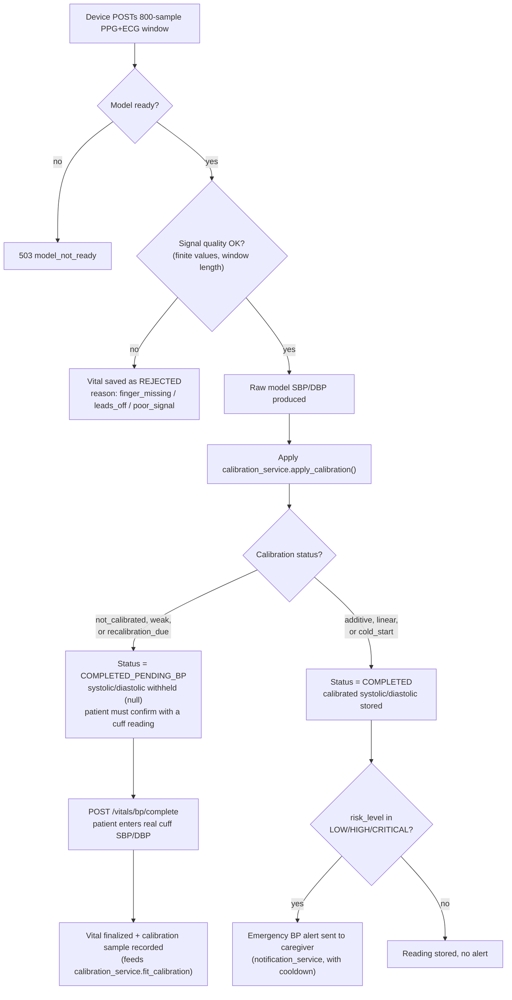

# Blood Pressure Prediction (Cuffless ABP Estimation)

This document covers the machine learning work behind Health Mate's cuffless blood
pressure feature: how the model was trained, what it actually achieves, and how it
is wired into the rest of the system. Everything below is drawn from the training
notebook `Predict-ABP/1_BP_Prediction_v6_Final/BP_Prediction_v6_Final.ipynb` (the
notebook is referred to internally as "v5" in its own print statements, even though
the file name says v6 — the team never renamed the internal version tag after the
last refactor) and from the deliverables it produced. Where the trained artifacts
are actually consumed by the backend, that integration is described too, because it
is the reason this model exists in the first place.

## 1. What the model does

The goal is to estimate systolic and diastolic blood pressure (SBP/DBP) from two
waveforms that a low-cost wearable can realistically capture: a PPG signal from a
pulse oximeter and an ECG signal from a chest sensor. No cuff is involved. This is
the "cuffless ABP estimation" problem, and it is a well-known hard problem in the
biomedical signal processing literature — PPG and ECG carry information correlated
with blood pressure (pulse transit time, waveform morphology) but the relationship
is nonlinear, patient-dependent, and easy to overfit to a specific dataset.

The model takes an 8-second window of PPG and ECG (800 samples each, at 100 Hz) and
outputs a single SBP/DBP pair for that window.

## 2. Dataset

The notebook loads `.mat` files (12 of them) where each file contains a set of
records, and each record is a `[3, N]` array: PPG, ABP (arterial blood pressure,
the reference signal), and ECG, all originally sampled at 125 Hz. This is the
standard structure of the MIMIC-derived cuffless blood pressure dataset that
circulates on Kaggle/PhysioNet — the notebook's own comments confirm this directly
("MIMIC training data", "MIMIC is clean" as an SNR justification).

Splitting is done at the **record level**, not the window level:

- 15% of records held out as test
- Of the remaining 85%, another 15% held out as validation
- The notebook asserts there is no overlap between the three index sets before
  proceeding — this matters because a window-level split would leak information
  (adjacent, overlapping windows from the same patient ending up in both train and
  test), which would make the reported metrics optimistic.

After extraction and quality filtering, the final counts are:

| Split | Windows |
|---|---|
| Train | 455,596 |
| Validation | 99,340 |
| Test | 98,079 |

The test set spans 1,631 distinct records (patients), which is later used for the
per-patient calibration simulation (Section 8 of this document).

### Windowing and reference labels

Each record is bandpass filtered, resampled from 125 Hz to 100 Hz, then cut into
8-second (800-sample) windows with 50% overlap (step size = 400 samples). For each
window:

- Systolic/diastolic reference values are derived from the ABP channel itself, by
  finding peaks and troughs (`scipy.signal.find_peaks`) and averaging their
  amplitudes — not from a separate cuff reading. This is standard practice for this
  dataset (the ABP waveform is an invasive arterial line reading in the source
  ICU data), but it does mean the "ground truth" here is continuous arterial line
  pressure, not sphygmomanometer cuff pressure, and the two are not identical in
  every clinical sense.
- Windows are rejected if peak/trough counts fall outside a plausible heart-rate
  range (40–180 bpm), or if the derived SBP/DBP fall outside plausible bounds
  (SBP 70–200 mmHg, DBP 40–130 mmHg, with DBP required to be lower than SBP).
- An SNR gate (`compute_snr_db`, threshold −7 dB) is applied to the PPG channel.
  In practice this keeps essentially 100% of windows — the notebook keeps it in
  as a safety net rather than because it does meaningful filtering on this
  particular dataset.

## 3. Preprocessing pipeline

The same three-step pipeline is applied to every window, and — importantly — the
exact same functions are reused verbatim in the production inference code
(`Back-end/app/services/abp_prediction_service.py`), so there is no drift between
what the model was trained on and what it sees at inference time:

1. **Bandpass filter** — 4th-order Butterworth, 0.5–8 Hz for PPG, 0.5–40 Hz for
   ECG (`scipy.signal.filtfilt`, zero-phase).
2. **Z-score normalization** — `(x - mean) / (std + 1e-8)`, per window, per
   channel.
3. **Feature extraction** — 21 hand-crafted features (below), also z-scored using
   a `StandardScaler` fit only on the training set.

Figures `fig_01_max30102_pipeline.png` and `fig_02_ad8232_pipeline.png` (in
`BP_Deliverables/`) show this pipeline applied to *synthetic* signals shaped like
real MAX30102/AD8232 output, specifically to demonstrate that raw sensor units
(ADC counts, ~150,000 DC offset for the PPG photodiode, ~512 DC offset for the
single-ended ECG front-end) collapse onto the same normalized scale the model was
trained on, regardless of the very different raw unit ranges the two sensors
produce. This was a deliberate check before ever wiring up real hardware.

## 4. Feature engineering

Alongside the raw waveform, a 21-dimensional hand-crafted feature vector is
computed per window and fed into a small dense side-branch (see Section 6). The
features:

| # | Feature | Description |
|---|---|---|
| 0–2 | `HR_bpm`, `RR_mean_s`, `RR_std_s` | Heart rate and RR interval statistics from PPG peaks |
| 3–4 | `PTT_mean_s`, `PTT_std_s` | Pulse transit time: PPG peak minus preceding ECG R-peak |
| 5 | `PPG_rise_time_s` | Time from preceding trough to peak |
| 6–7 | `PPG_amp_mean`, `PPG_amp_std` | Pulse amplitude (peak − preceding trough) |
| 8–11 | `PPG_mean/std/skew/kurt` | Basic PPG waveform statistics |
| 12–13 | `VPG_mean`, `VPG_std` | First derivative of PPG (velocity plethysmogram) |
| 14–15 | `APG_mean`, `APG_std` | Second derivative of PPG (acceleration plethysmogram) |
| 16–17 | `ECG_RR_mean_s`, `ECG_RR_std_s` | RR interval from ECG R-peaks |
| 18 | `ECG_QRS_width_s` | Approximate QRS width around each R-peak |
| 19–20 | `ECG_mean`, `ECG_std` | Basic ECG waveform statistics |

Pulse transit time is the feature most grounded in physiology here — it is the
classical basis for cuffless BP estimation (shorter PTT roughly correlates with
higher arterial pressure), and the notebook's correlation analysis
(`fig_05_feature_correlation.png`) confirms it and heart rate carry the strongest
linear correlation with SBP/DBP among the 21 features, though none of the
hand-crafted features individually correlate strongly enough to make a case for a
pure feature-based (i.e., non-waveform) model.

## 5. Class imbalance: why sample weights instead of downsampling

Windows are labeled into four BP categories using a simple rule (SBP/DBP
thresholds): Hypotension, Normal, Elevated, Hypertension. In the training set
these are heavily imbalanced — Hypertension and Hypotension together make up the
large majority of windows, Normal and Elevated are comparatively rare (see
`fig_03_bp_distribution.png`).

This is documented in the notebook as a direct lesson learned from an earlier
attempt (referred to as "v10"): that version forced class balance by discarding
windows down to 50K per class, which threw away the majority of the real dataset
and made the model worse overall (SBP MAE 11.47, worse than an even earlier
unbalanced attempt at 9.13). The current approach instead computes a per-window
`sample_weight` from inverse class frequency, clipped to a maximum ratio of 5x
(`fig_04_class_weights.png`), and keeps every real window. All models — classical
and deep learning — are trained with this sample weighting.

## 6. Data augmentation

A modest amount of synthetic augmentation (15% of the real training set size, vs.
40% in the earlier "v10" attempt) is layered on top of the full real dataset,
using three sensor-realistic perturbations applied together per augmented sample:

- Additive white Gaussian noise, injected at a target SNR of 25 dB.
- Slow baseline wander (a low-frequency sinusoid, 0.05–0.3 Hz, random phase/amplitude).
- Random amplitude scaling (0.8–1.2x for PPG, 0.85–1.15x for ECG).

This adds 68,339 synthetic windows on top of the 455,596 real ones, bringing the
effective training set to 523,935 windows (train set is shuffled after
augmentation so real and synthetic windows are interleaved for training).

## 7. Models trained

Ten models were trained and evaluated on the identical test set, all using the
same 21 hand-crafted features (classical models) or the same waveform + feature
combination (deep learning models), and all trained with the same sample weights.

**Classical ML (6):** Ridge, ElasticNet, Random Forest, XGBoost, LightGBM,
CatBoost — each wrapped in `MultiOutputRegressor` to predict SBP/DBP jointly
(CatBoost trains two separate single-output models instead, since its API handles
sample weights differently). XGBoost and CatBoost attempt GPU training first and
fall back to CPU automatically if the GPU path throws.

**Deep learning (4):** all four share a common two-branch design — a waveform
encoder that consumes the raw `(800, 2)` PPG+ECG tensor, and a small dense
"feature branch" that consumes the 21 hand-crafted features — concatenated before
a shared prediction head (two dense layers → 2 outputs, SBP and DBP).

| Model | Encoder | Params |
|---|---|---|
| 1D-CNN | 4-stage causal-free Conv1D + MaxPooling, global average pool | 485,154 |
| BiLSTM | 2 Conv+Pool stages (800→50 steps) feeding a Bidirectional LSTM | 371,234 |
| TCN | 4-stage dilated causal Conv1D residual blocks (dilations 1/2/4/8), each halving the sequence length | 1,017,634 |
| TCN+BiLSTM+Attn (ours) | TCN encoder → Bidirectional LSTM → 4-head self-attention → residual + LayerNorm | 1,544,610 |

The BiLSTM architecture note is worth calling out: an earlier version ran the LSTM
directly over all 800 raw timesteps, which was the slowest model in the whole
ablation (64ms/step). The current version downsamples to 50 steps with two
Conv+Pool stages before the LSTM ever sees the sequence — the same trick the
TCN-based models already used — which is a meaningful, documented performance fix
rather than an incidental architecture choice.

The "ours" model (TCN+BiLSTM+Attn) is the team's proposed architecture — it
combines dilated convolutions for multi-scale temporal context, a bidirectional
LSTM for sequential state, and multi-head self-attention to let the model weight
different parts of the 8-second window when forming its prediction. Despite this
being the most sophisticated architecture in the study, it did not come out on
top (see Section 8) — a result the notebook does not hide or spin, and neither
does this document.

### Regularization: a documented course-correction

The parameter section of the notebook explicitly documents why the current
hyperparameters differ from an earlier attempt ("v4"): v4 used no L2
regularization at all, which produced an 86% train/validation MAE gap (severe
overfitting). The current configuration uses light L2 (1e-5) and 0.3 dropout,
which brings the healthiest models' overfitting gap down substantially — this is
visualized directly in `fig_16_overfitting_analysis.png`. The notebook also
removed a decoder branch that existed in v4 for an (apparently abandoned)
reconstruction loss that "never moved" during training — dead weight that added
parameters without adding signal.

Training itself uses Huber loss (more robust to the occasional mislabeled/noisy
window than plain MSE), Adam with gradient clipping, `ReduceLROnPlateau`, and
early stopping on validation MAE with `restore_best_weights=True`. Training ran on
a dual-T4 Kaggle session with `MirroredStrategy` and mixed-precision
(`mixed_float16`).

### Fault tolerance and reproducibility

Every expensive stage — window extraction, feature engineering, and each
individual model's training — checkpoints to disk. If the notebook's session is
interrupted (a real risk on free Kaggle GPU quotas) and restarted from the top,
already-completed stages are detected from cached files and skipped rather than
recomputed. Each model is also wrapped in its own `try/except`, with failures
logged to a file, so one model crashing (e.g., an XGBoost GPU driver error) does
not take down the rest of the run. This is why the notebook's own execution log
shows lines like `[cached] skipping recomputation` and `already trained -
skipping` — the notebook was run across multiple sessions, and this defensive
structure is what made that practical on a shared, quota-limited Kaggle GPU.

## 8. Results

Final test-set metrics for all ten models, sorted by SBP MAE (from
`BP_Deliverables/results_sbp.csv` and `results_dbp.csv`):

| Model | SBP MAE | SBP BHS | DBP MAE | DBP BHS |
|---|---|---|---|---|
| **1D-CNN (best)** | **9.08** | D | **4.91** | B |
| TCN | 9.79 | D | 5.31 | B |
| TCN+BiLSTM+Attn (ours) | 10.17 | D | 5.63 | B |
| BiLSTM | 14.34 | D | 7.28 | C |
| XGBoost | 14.71 | D | 7.45 | C |
| CatBoost | 15.13 | D | 7.58 | C |
| LightGBM | 15.16 | D | 7.59 | C |
| Random Forest | 15.80 | D | 7.83 | C |
| Ridge | 18.03 | D | 8.59 | D |
| ElasticNet | 18.37 | D | 8.73 | D |

Against the reference clinical standards built into the notebook:

- **AAMI SP10** (requires MAE ≤ 5 mmHg *and* SD ≤ 8 mmHg): every model fails this
  for SBP. The best model (1D-CNN) **passes** it for DBP (MAE 4.91, SD 7.77).
- **BHS protocol** grades models A–D based on the percentage of errors within 5,
  10, and 15 mmHg. The best SBP result is Grade D; DBP reaches Grade B.

The simplest deep learning architecture — the plain 1D-CNN — was the best
performer overall, beating both the TCN and the more elaborate
TCN+BiLSTM+Attention model the team specifically designed for this problem. All
three deep learning waveform models comfortably outperformed every classical
feature-only model, which is consistent with the idea that the raw waveform
carries information the 21 hand-crafted features alone do not fully capture — but
within the deep learning models, more architectural complexity did not translate
into better accuracy on this dataset. The result is documented as-is; the
notebook does not attempt to explain away why the attention model underperformed,
and this documentation does the same.

For context, the notebook tracks a "v4 baseline" reference result (SBP MAE 9.13,
DBP MAE 5.19) from an earlier, larger, unregularized model. The current best
model (1D-CNN, SBP MAE 9.08) is a small improvement over that baseline on SBP and
a slightly larger one on DBP (4.91 vs. 5.19) — modest gains, achieved with
better-controlled overfitting rather than a fundamentally different result.

### Clinical evaluation figures (best model, 1D-CNN)

All generated and saved in `BP_Deliverables/`:

- `fig_17_scatter_sbp.png`, `fig_18_scatter_dbp.png` — true vs. predicted scatter, colored by absolute error, with ±5 mmHg reference bands.
- `fig_19_timeseries.png` — true vs. predicted SBP/DBP over a short run of consecutive test windows.
- `fig_20_bland_altman_sbp.png`, `fig_21_bland_altman_dbp.png` — Bland-Altman agreement plots (mean bias ± 1.96 SD limits of agreement).
- `fig_22_error_distribution.png` — error histograms for SBP/DBP relative to the ±5 mmHg AAMI band.
- `fig_23_bhs_best_model.png` — cumulative error-threshold curve for the best model against the BHS A/B/C grade bands.
- `fig_24_per_class_mae.png` — MAE broken down by the four BP categories (Hypotension/Normal/Elevated/Hypertension). This is a meaningful cut because the AAMI/BHS headline numbers are pooled across all categories; per-class MAE shows whether error is evenly spread or concentrated in the rarer classes the sample-weighting scheme was specifically trying to protect.

## 9. Calibration simulation — and an honest reading of its own result

Section 15 of the notebook simulates a specific product decision, and — unlike
when this section was first drafted — the product side of that decision is no
longer just a plan: `Back-end/app/services/calibration_service.py` is a working
implementation of exactly this idea, already wired into
`POST /api/v1/vitals/bp/submit`. It fits `adjusted = scale × model_output +
offset` per patient, but with more nuance than a single fixed procedure:

- Under 8 recorded cuff-vs-model sample pairs, it uses a **median-only additive
  offset** (`scale = 1.0`, offset = median of `cuff − model` differences) —
  deliberately resistant to a single noisy calibration point.
- At 8 or more samples, it upgrades to a **least-squares linear fit** of
  `scale`/`offset` (`np.polyfit`), matching what the notebook simulates.
- Both paths clamp `scale` to `[0.70, 1.30]` and `offset` to `[-25, +25]` mmHg,
  and the service records whether a fit needed clamping (marking the
  calibration `"weak"` if so).
- A separate scheduled job (`bp_drift_service.py`) monitors each patient's
  *raw, pre-calibration* model output over their last 10 completed readings,
  and flags `drift_detected` if the mean has sustained a shift of more than 8
  mmHg (SBP) or 5 mmHg (DBP) from the baseline established at calibration time,
  or flags `calibration_stale` after 90 days — either one triggers a push
  notification asking the patient to recalibrate, with a 14-day cooldown so it
  doesn't spam them.

Given that a real implementation already exists, the notebook's oracle
simulation is best read as a *validation exercise for the general idea*, run
before that implementation existed — not as an approximation the product code
still has to catch up to. The question the notebook asks remains useful:
on this exact test set, would per-patient linear calibration actually help?

**Method:** for every test-set patient with at least 4 windows, the first 3
windows (in time order) are treated as an oracle calibration set — i.e., the true
BP values for those windows stand in for perfect cuff readings, which is a
best-case assumption since a real cuff has its own measurement noise. A
scale/offset is fit by least squares from those 3 points and applied to that
patient's remaining windows; metrics are then recomputed across all patients'
remaining windows pooled together.

**Result**, from the notebook's own printed output:

| Metric | SBP raw | SBP calibrated | DBP raw | DBP calibrated |
|---|---|---|---|---|
| MAE (mmHg) | 9.04 | 14.52 | 4.89 | 6.99 |
| SD (mmHg) | 13.15 | 16.20 | 7.74 | 8.45 |
| AAMI | FAIL | FAIL | PASS | FAIL |
| BHS | D | D | B | C |

Calibration made both SBP and DBP **worse**, not better — MAE increased by 5.48
mmHg for SBP and 2.10 mmHg for DBP, and the DBP result specifically regressed from
an AAMI PASS to a FAIL. The notebook's own closing print statement for this
section claims the opposite ("confirms the calibration feature is worth
building"), but that conclusion does not match the numbers computed one cell
earlier in the same notebook. This documentation reports the numbers as they are,
not the narrative text that was printed alongside them.

The most likely explanation, based on how the calibration points were chosen: the
3 "calibration" windows are just the first three 8-second, 50%-overlapping windows
of a single continuous ICU recording, not three independent measurements taken at
meaningfully different times or physiological conditions. `calibration_service.py`
in the actual backend accumulates its samples the way the real product measures
BP — one submitted reading at a time, over however many days it takes to reach
its 8-sample linear-fit threshold — which is a fundamentally different sampling
process from three adjacent 8-second slices of one continuous ICU recording.
MIMIC ICU records can show real short-term BP drift within a single stay, so a
scale/offset fit to one narrow slice near the start of a recording has little
reason to generalize to the rest of that same recording. In other words, this
simulation does not faithfully represent how the deployed calibration service
actually accumulates its samples, and its negative result should not be read as
a verdict on that service either way — it is a strong argument for validating
the deployed calibration logic against real, time-separated cuff readings before
leaning on it clinically, rather than for or against the underlying idea.
`fig_25_calibration_before_after.png`, `fig_26_calibration_param_distribution.png`,
and `fig_27_scatter_sbp_calibrated.png` visualize this same simulation.

## 10. Export and inference

The notebook exports three artifacts, saved from the best model's checkpoint
(1D-CNN in this run):

- `bp_model_final.keras` — the trained Keras model.
- `scaler_features.pkl` — the `StandardScaler` fit on the 21 training features.
- `scaler_targets.pkl` — the `StandardScaler` fit on the SBP/DBP training targets (inverse-transformed to get mmHg back out of the model's normalized output).

It also defines a `predict_bp(ppg_raw_100hz, ecg_raw_100hz)` function as a
template for production inference: bandpass filter → z-score normalize → build
the `(1, 800, 2)` waveform tensor and the 21-feature vector → run the model →
inverse-transform the scaled output back to mmHg.

**This template is not just a notebook exercise — it has actually been carried
into the backend.** `Back-end/app/services/abp_prediction_service.py` reimplements
the identical bandpass/normalize/feature-extraction pipeline and calls the model
the same way (`model({'waveform_input': ..., 'feature_input': ...}, training=False)`),
and the three exported artifact files are present in
`Back-end/app/services/models/` (`bp_model_final.keras`,
`scaler_features.pkl`, `scaler_targets.pkl`), copied over verbatim. On top of the
notebook's template, the backend service adds:

- Graceful startup: if the model files are missing, the service reports
  `model_not_ready` instead of crashing the API process.
- Input validation (exact window length, all-finite check) before running inference.
- Physiological clamping of the output (SBP 50–300 mmHg, DBP 30–200 mmHg, HR
  30–220 bpm) as a final safety net against a degenerate model output ever
  reaching a patient screen.

The prediction is wired into `POST /api/v1/vitals/bp/submit`
(`Back-end/app/api/v1/vitals.py`), which is the endpoint the BP hardware device
calls after collecting an 8-second PPG+ECG window. That route also applies a
calibration step (`get_calibration_service()`) after the raw model prediction, and
persists a `REJECTED` vital sign record (rather than failing silently) when the
signal quality is poor, tagging the rejection reason as `finger_missing`,
`leads_off`, or `poor_signal` depending on the device's own diagnostic flags. Full
endpoint-level detail belongs in `BACKEND.md`; the point here is that the model
described in this document is not sitting unused — it is the model actually
loaded and called in production.

The firmware side of this loop (`bp-hardware-code/bp-hardware-code.ino`) matches
the model's exact input contract rather than approximating it: the MAX30102 is
configured with `sampleAverage=1` specifically to produce raw, unaveraged 100 Hz
output (`ppg.setup(60, 1, 2, 100, 411, 4096)`), matching `FS = 100` in both the
notebook and `abp_prediction_service.py`. The firmware buffers exactly 800
PPG/ECG samples (the same `WINDOW_SIZE` the model was trained on), gates
collection on finger presence (IR > 50,000 counts) and ECG lead-off pins before
accepting samples, and POSTs the completed window to `/vitals/bp/submit` with
device-identifying headers and an exponential-backoff retry policy — it does
not abort silently on a failed upload. A separate 10-second heartbeat (sent
immediately on any finger/lead state change, not just on a timer) keeps the
backend's `RegisteredDevice.last_finger_detected`/`last_leads_connected` flags
current, which is what lets `/bp/submit` label a rejected reading with the
correct reason instead of a generic failure.

## 11. Documentation diagrams already generated

The notebook itself generates nine Graphviz/matplotlib diagrams intended for this
kind of documentation, saved in `BP_Deliverables/`. These already exist and should
be reused directly rather than redrawn:

| Figure | Content |
|---|---|
| `fig_28_system_architecture.png` | Hardware → backend → app system architecture |
| `fig_29_pipeline_stage_a.png`, `fig_30_pipeline_stage_b.png` | Data processing pipeline, split into two stages for readability |
| `fig_31_model_architecture_overview.png` | Conceptual overview of the two-branch (waveform + feature) model design |
| `fig_32_keras_1d_cnn.png`, `fig_33_keras_bilstm.png`, `fig_34_keras_tcn.png`, `fig_35_keras_full_model.png` | Auto-generated exact Keras layer graphs (`plot_model`) for each of the four architectures |
| `fig_36_training_workflow.png` | Training workflow and fault-tolerance/resume design |
| `fig_37_hardware_wiring.png` | Pin-level hardware wiring diagram |
| `fig_38_calibration_drift_flow.png` | Calibration and drift-detection decision flow |
| `fig_39_inference_flow.png` | Real-time inference flow with an approximate per-step latency budget (the notebook estimates roughly 8–10 seconds end-to-end, dominated by the 8-second measurement window itself, not by model inference which is on the order of 80ms) |
| `fig_40_final_summary.png` | One-page final summary panel (best model, baseline, calibration result, reliability features) |

## 12. Limitations

Stated plainly, without softening:

- **The headline SBP result fails the AAMI standard.** Only DBP passes. This is a
  real, unresolved accuracy gap for the primary clinical number (systolic
  pressure) that any downstream product decision needs to account for — e.g., by
  treating SBP as an indicative trend rather than a diagnostic-grade reading.
- **The proposed novel architecture (TCN+BiLSTM+Attention) did not outperform a
  much simpler 1D-CNN.** This suggests either the extra capacity is not being
  used effectively for this task/dataset size, or the additional architectural
  complexity is solving a problem (long-range temporal dependency, multi-scale
  attention) that an 8-second single-window prediction task doesn't actually have
  much of.
- **The dataset is ICU patients (MIMIC), not ambulatory or healthy subjects.**
  A model trained on ICU arterial line data may not transfer cleanly to a
  wearable, resting, largely healthy or moderately hypertensive home-use
  population, which is the population the actual product targets.
- **The calibration simulation's own negative result is inconclusive** for the
  reasons explained in Section 9 — it tested a scenario (three overlapping
  windows from one recording) that does not resemble how the deployed
  `calibration_service.py` actually accumulates samples (one real submitted
  reading at a time), so it answers a narrower question than the one that
  matters for the deployed service.
- **The model itself has not been validated against real hardware recordings.**
  Every metric in this document comes from the held-out MIMIC test set. The
  ESP8266 firmware described in Section 10 is real, functional, and matches
  the model's input contract exactly (100 Hz, 800-sample windows,
  `sampleAverage=1`), and the backend inference path is genuinely wired up —
  but no accuracy numbers from an actual MAX30102/AD8232 recording on a live
  subject have been produced. The gap here is a validation gap (has anyone
  measured accuracy on real sensor data?), not an integration gap (is the
  pipeline wired together correctly?) — the two are separate questions, and
  only the second one is answered by the code as it stands.

## 13. Future improvements (as reasonably inferable from the notebook's own framing)

- Collect a small set of real MAX30102/AD8232 recordings alongside reference
  cuff readings, and measure the model's actual MAE on that data — the
  strongest remaining unknown is not in the code, it's in the absence of this
  measurement.
- Re-run the calibration simulation using calibration points genuinely
  separated in time/condition (mirroring how `calibration_service.py` actually
  accumulates samples in production — one submitted reading at a time, over
  days) rather than adjacent overlapping windows from a single recording.
- Investigate why the attention-based model underperformed the simpler 1D-CNN —
  candidates include insufficient training data diversity for the attention
  mechanism to earn its extra parameters, or an inductive bias mismatch for
  single fixed-length windows.
- Since SBP is the metric that fails AAMI, targeted work on SBP specifically
  (rather than a joint SBP/DBP objective) may be worth exploring, given DBP
  already clears the clinical bar.

## 14. What actually happens to a reading after the model runs

The notebook and `abp_prediction_service.py` end at a raw SBP/DBP number.
What happens next — traced directly from `POST /api/v1/vitals/bp/submit` in
`app/api/v1/vitals.py` — is a real state machine, not just "save it and show
it," and is worth diagramming here since it's the part of this feature a
patient actually experiences:

The `COMPLETED_PENDING_BP` state is the detail most likely to be missed
reading the model/service code in isolation: until a patient has enough
calibration history for the fit to be trusted (8+ paired samples, or at least
a non-stale, non-clamped fit), the backend deliberately withholds the
numeric SBP/DBP from the response rather than showing an unvalidated number,
and requires a manual cuff confirmation (`/vitals/bp/complete`) to close the
loop — which is also how new calibration samples get collected in the first
place. This is the mechanism that actually produces the "8+ samples" data
`calibration_service.py`'s linear-fit upgrade depends on (Section 9).

[IMAGE REQUIRED] Description: Screenshot of the deployed BP measurement flow in the Flutter app (guided measurement screen, live reading, cuff-confirmation prompt, or history chart) to sit alongside the flow diagram above. Suggested Location: Section 14, or the Illustrative Examples chapter of the main thesis document. Purpose: show the model's output actually reaching a patient-facing screen — the diagram above is generated from the backend logic, but no build/run pass has captured the corresponding UI screens yet.
