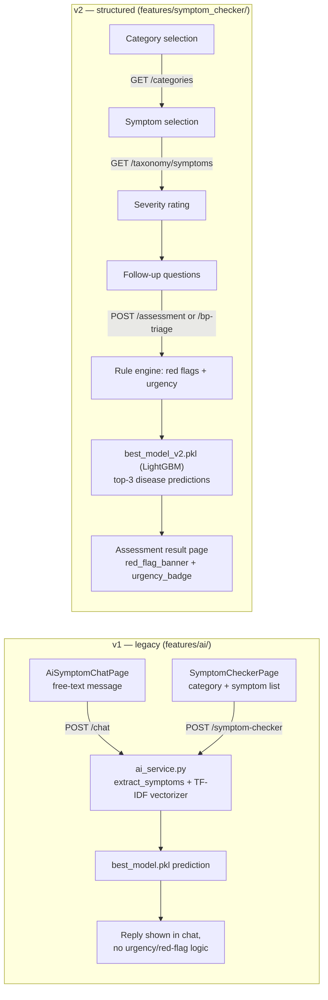

# Symptom Checker / Disease Triage

Health Mate does not have one symptom checker — it has two, built at different
times, using different techniques, and both still live in the codebase today.
This document describes both honestly: what each one actually does, which
frontend screens call which one, and where they diverge in quality. Everything
here is drawn directly from the training scripts, the generated model
artifacts (metadata JSON, evaluation reports, baseline comparisons — all of
which are code-generated outputs, not hand-written prose), and the backend/
frontend source itself.

## 1. Two implementations, both currently active

| | v1 (legacy) | v2 (structured) |
|---|---|---|
| Input | Free-text chat or a flat list of selected symptom names | Structured assessment: symptoms with severity, duration, age group, known conditions, optional vitals |
| Representation | TF-IDF-style vectorizer over symptom text | 232-dimensional hand-built numeric feature vector |
| Model | Trained via `train_model.py`, selected from classical scikit-learn candidates | `LGBMClassifier` (LightGBM), trained via `training/train_final.py` |
| Artifacts | `best_model.pkl`, `vectorizer.pkl`, `model_metadata.json` | `best_model_v2.pkl`, `label_encoder_v2.pkl`, `model_metadata_v2.json` |
| Backend code | `app/services/ai_service.py` (flat service, loaded at app startup) | `app/domain`/`app/application`/`app/infrastructure` (clean-architecture layers, wired via `app/core/di.py`) |
| Backend endpoints | `POST /symptom-checker`, `POST /chat` | `POST /assessment`, `POST /bp-triage`, `GET /categories`, `GET /taxonomy/symptoms`, `POST /chat/from-assessment` |
| Frontend screen(s) | `features/ai/` — `AiSymptomChatPage` (free chat) and the older `SymptomCheckerPage` | `features/symptom_checker/` — a five-step wizard (category → symptoms → severity → follow-up → result) |
| Safety logic | None beyond whatever the model predicts | A dedicated rule engine (Section 5) that can escalate urgency independently of the ML prediction |

Both are reachable from the running app today — they are not a
before/after where one has replaced the other. The backend setting
`symptom_checker_v2_enabled` (default `true` in `app/core/config.py`) gates
whether the v2 endpoints are active, but it does not disable v1; `main.py`
loads the v1 model at startup unconditionally.

## 2. v1: free-text / flat-symptom classifier

### Training

`Symptom-Checker/train_model.py` builds a TF-IDF vectorizer (`max_features` capped
at 5000, 1–3 word n-grams) over symptom text, then trains and compares five
classical models: Random Forest, Gradient Boosting, linear-kernel SVM,
multinomial Logistic Regression, and Multinomial Naive Bayes — selecting
whichever scores highest test accuracy.

**A real discrepancy worth flagging plainly:** the model files actually
shipped in `Output/Production/` (`best_model.pkl`) are accompanied by an
`Output/Models_Archive/` directory containing eleven trained model files,
including `Standard_MLP.pkl`, `Wide_Neural_Network.pkl`, and
`Deep_Neural_Network.pkl` — none of which are candidates in the current
`train_model.py` script (it only ever trains the five models listed above; no
`MLPClassifier` import exists in it at all). This means the `train_model.py`
script in the repository today is **not** the script that actually produced
the model currently deployed in `Output/Production/` — an earlier version of
the training pipeline (with a larger candidate model set including neural
networks) produced the archive and, most likely, the currently-deployed
`best_model.pkl` as well. This documentation does not guess at what that
earlier script looked like; it simply notes that the current `train_model.py`
cannot be assumed to reproduce the deployed model if re-run.

### Inference (`app/services/ai_service.py`)

- `extract_symptoms(text)` — pulls recognizable symptom keywords out of free
  text, with an Arabic normalization step (`_normalize_arabic`) so Arabic
  input isn't penalized by inconsistent diacritics/character forms.
- `predict_disease(symptoms)` — joins the recognized symptoms into a string,
  transforms it with the loaded TF-IDF vectorizer, and calls
  `model.predict`/`predict_proba`.
- `model_metadata.json` doubles as a bilingual dictionary: it embeds
  `symptom_translations` and `disease_translations` (English↔Arabic) and a
  `categories` map (specialty → representative symptom list) directly
  alongside the model's own metadata — translation data and model metadata
  live in the same file for this version, rather than being separated.

This path has no structured awareness of severity, duration, age, known
conditions, or vitals — architecturally, a TF-IDF-over-symptom-names model
has no slot to put that information even if it were collected, which is
precisely why v2 exists.

## 3. v2: structured, rule-engine-backed assessment

### Why it exists

v2 is not a tuning pass on v1 — it is a different representation entirely,
built because the free-text/TF-IDF approach could not incorporate severity,
duration, age group, comorbidities, or vitals (there is no way to weight "mild
headache for 2 days" differently from "severe headache for 2 weeks" in a
bag-of-words vectorizer). The dataset, features, model, and serving code were
all rebuilt for this reason.

### Dataset generation (`data_pipeline/generate_structured_cases.py`)

The training set is **synthetic**, generated from the taxonomy files in
`Symptom-Checker/taxonomy/` (`categories.json`, `symptoms.json`,
`diseases.json`), and the script is explicit about this rather than
disguising it as real patient data:

- Each disease's `related_symptom_ids` becomes a symptom-inclusion
  probability profile (symptoms listed earlier for a disease get a higher
  probability, from 0.85 down to a floor of 0.35).
- Each synthetic case then independently samples severity, duration, age
  group, and optional risk factors/vitals around that profile.
- A target of 300 cases per disease is generated (the resulting dataset is
  `Data/cases/dataset.jsonl`, split 9,840 train / 2,460 test at training
  time).
- **Urgency labels are not hand-assigned or invented separately** — every
  generated case is run through the real domain rule engine
  (`app/domain/rules_engine`, the same code that gates live assessments) to
  compute its urgency label, so the dataset can never encode an urgency value
  that disagrees with the logic that will actually judge real users.
- Specific attention was given to three commonly-confused disease clusters:
  Common Cold vs. Influenza vs. COVID-19 (differentiated mainly by duration,
  severity, and a boosted probability of `loss_of_taste_smell` for COVID-19),
  and Hypertension vs. Migraine vs. Stroke (these three need no artificial
  help — their symptom sets don't overlap in the taxonomy at all; Hypertension
  additionally gets a high probability of carrying elevated vitals, which the
  other two don't).

### Feature vector (`training/feature_engineering.py`, 232 dimensions)

One function, `build_features()`, is the single source of truth for the
feature layout — imported directly by both the training scripts and the
backend's inference path (see Section 4), so there is no risk of the two
silently drifting apart. The 232-dimension vector is laid out as:

| Segment | Size | Content |
|---|---|---|
| Symptom presence | N_symptoms | Multi-hot: 1 if the symptom was selected |
| Symptom severity | N_symptoms | 0 if absent, else the reported severity |
| Duration bucket | 4 | One-hot: `<1`, `1–3`, `4–7`, `>7` days |
| Age group | 3 | One-hot: child / adult / elderly |
| Risk factors | 5 | Multi-hot over a small comorbidity pool (hypertension, type 2 diabetes, asthma, hypothyroidism, chronic kidney disease) |
| Vitals | 4 | Normalized systolic/diastolic/heart rate (clipped to clinically reasonable ranges) plus a `vitals_present` flag |

The risk-factor pool is a deliberate, documented workaround: the taxonomy has
no dedicated "risk factor" concept, so the code reuses a small set of existing
disease IDs as comorbidity flags rather than inventing a new taxonomy —
called out directly in the code as a gap rather than silently patched over.

### Model (`training/train_final.py`)

`LGBMClassifier`, multiclass objective, 300 estimators, learning rate 0.05,
40 disease classes, trained on the 9,840/2,460 stratified split described
above.

## 4. Results — reported plainly, including where the fancier model loses

From `model_metadata_v2.json` / `evaluation_report_v2.md`:

- **Top-1 accuracy: 0.8581**
- **Top-3 accuracy: 0.9549**

The report explicitly disowns the older 0.9034 accuracy figure sometimes
quoted for the v1 model as a fair comparison point: that number was measured
on the same narrow synthetic method used to train it, with no held-out
real-world distribution, and the metadata's own caveat field says so in these
words (this is the generated metadata talking about itself, not commentary
added here).

**The confusable-pair check works.** The three-way Common Cold / Influenza /
COVID-19 split and the Hypertension / Migraine / Stroke split are both
resolved with zero cross-confusion in the held-out test set — the
differentiation strategy described in Section 3 achieved what it set out to
do.

**The ten worst-performing classes are almost entirely cardiac subtypes**,
per-class top-1 accuracy:

| Disease | Accuracy |
|---|---|
| Myocarditis | 0.350 |
| Hypertrophic cardiomyopathy | 0.400 |
| Coronary artery disease | 0.517 |
| Congestive heart failure | 0.600 |
| Pericarditis | 0.600 |
| Ventricular tachycardia | 0.650 |
| Heart failure | 0.683 |
| Pulmonary hypertension | 0.683 |
| Stable angina | 0.700 |
| Aortic stenosis | 0.750 |

Given that cardiovascular disease is the project's core clinical focus (it is
the specialty the BP feature is built around), this is a meaningful,
practically relevant weakness, not a peripheral one — the model is
noticeably weaker exactly where the product needs it to be strong. These
diseases share heavily overlapping symptom sets in the taxonomy (fatigue,
palpitations, chest pain, dyspnea, edema recur across most of them), and the
synthetic data-generation process did not apply the same targeted
differentiation effort to these cardiac pairs that it applied to the
respiratory and hypertension/neurological triads in Section 3.

**A more fundamental, easy-to-miss finding**: `baseline_comparison.json`
(produced by `training/train_baseline.py`, trained on the identical feature
matrix and an identical stratified split) shows plain Logistic Regression
scoring **0.8703** accuracy and Random Forest **0.8663** — both higher than
LightGBM's 0.8581. The model chosen for production is not the model that
scored highest on this exact dataset and feature set; the simpler linear
baseline did better. (`train_baseline.py`'s own header comment frames these
two as "for comparison only," with LightGBM as "the actual candidate for
production" — a decision that, per these numbers, was not purely
accuracy-driven.) This mirrors a pattern seen elsewhere in this project's AI
work (see `BP_PREDICTION.md`, where the simplest deep learning model also beat
a more sophisticated one) and is reported here with the same lack of
spin.

## 5. Safety layer: the rule engine

This is what separates v2 from "just a classifier." Two pure-function rule
modules sit between the raw assessment input and the final result, and — per
an explicit design rule stated directly in the code — **the rule engine can
only escalate urgency, never suppress it**; the ML model's prediction is never
allowed to override a rule-engine-detected red flag downward.

- **`red_flag_rules.py`** — certain symptoms are flagged as red flags in the
  taxonomy; most require severity ≥ 2 to trigger, but syncope, loss of
  consciousness, and sudden loss of consciousness trigger at any severity
  ≥ 1, reflecting that these are inherently urgent regardless of how the
  patient self-rates their severity.
- **`urgency_rules.py`** — combines red flags with a vitals-derived urgency
  floor (`bp_rules.py`) into one of four levels: `critical` (any red flag at
  severity ≥ 3, or critical vitals), `high` (any red flag, or high vitals),
  `moderate` (≥2 moderate-severity symptoms, or known hypertension with
  elevated vitals), or `low`.
- **`bp_rules.py`** — a single shared source of BP/SpO2/HR thresholds
  (SBP ≥ 180 or DBP ≥ 120 or SpO2 < 90 → critical; SBP ≥ 140 or SBP < 90 or
  DBP ≥ 90 or SpO2 < 94 → high), explicitly written to be the *one* place
  these numbers live rather than duplicated between the symptom checker and
  the BP feature's own alerting. The module's own comments are candid about
  what is and isn't settled: the "elevated BP" boundary (SBP ≥ 130 / DBP ≥ 80,
  used only to detect "known hypertension + elevated reading" → moderate) is
  flagged in the source as following a standard public clinical reference
  because no explicit numeric boundary was ever specified for it elsewhere,
  and the comment states outright that it "needs explicit clinical/product
  sign-off before this ships" — a genuine, unresolved gap that this
  documentation is not going to paper over.

### BP-triage integration

`POST /bp-triage` (`app/application/use_cases/run_bp_triage.py`) runs the same
assessment pipeline as `/assessment`, then adds one BP-specific override: if
vitals were provided and the resulting urgency is `moderate` or `high` (not
yet `critical`), the response is overridden to recommend the patient rest five
minutes and re-measure, in both English and Arabic. This is the concrete
implementation of the "ask the patient to re-measure on a borderline high
reading, notify the caregiver immediately on a confirmed critical one" policy
— it exists in code today, wired into the same endpoint the Flutter symptom
checker wizard calls (`ApiConstants.aiBpTriage`).

## 6. Optional LLM phrasing layer

`app/infrastructure/phrasing/assessment_phraser.py` implements an optional,
disabled-by-default layer (`symptom_checker_llm_phrasing_enabled`, default
`false`) that can rewrite only two text fields of the result
(`patient_message`, `caregiver_summary`) through an OpenAI-compatible chat
completion call. It is deliberately additive and fails closed: any malformed
response, missing field, timeout, or client error simply returns the
unmodified, rule/model-generated result rather than blocking or crashing the
assessment. The static, template-based text is the actual source of truth;
the LLM never determines urgency, red flags, or the disease prediction
itself — only optionally smooths the wording of two already-decided fields.

## 7. A genuinely cross-cutting piece of plumbing worth naming

`app/infrastructure/ml/structured_feature_builder.py` does not reimplement the
232-feature vector layout — it imports `build_features()` directly from
`Symptom-Checker/training/feature_engineering.py` at request time, by
inserting `settings.symptom_checker_root_path` onto `sys.path`. This means the
FastAPI backend's live inference path is, at runtime, importing a module that
lives inside what looks like a sibling top-level project directory
(`Symptom-Checker/`), not inside `Back-end/` at all. This guarantees the
training feature layout and the inference feature layout can never silently
diverge (a real, valuable guarantee), at the cost of a real fragility: moving,
renaming, or restructuring `Symptom-Checker/training/` — or removing its own
dependencies — would break backend inference at runtime in a way that is not
obvious from reading `Back-end/` in isolation.

## 8. Frontend: two parallel screens for two parallel backends

- **`features/ai/`** calls the v1 endpoints — `AIRepository.sendMessage()` →
  `POST /chat` (free conversational chat) and `AIRepository.analyzeSymptoms()`
  → `POST /symptom-checker` (category/sub-category/symptom-list flow). This is
  the older `SymptomCheckerPage` plus the newer `AiSymptomChatPage`.
- **`features/symptom_checker/`** calls the v2 endpoints exclusively —
  `SymptomCheckerRemoteDataSource` hits `GET /categories`,
  `GET /taxonomy/symptoms`, `POST /assessment`, and `POST /bp-triage`, backing
  a five-screen wizard: category selection → symptom selection → severity
  rating → follow-up questions → assessment result (with dedicated
  `red_flag_banner.dart` and `urgency_badge.dart` widgets to surface the rule
  engine's output, not just the ML prediction).

Both screens are present in the app today; which one a user reaches depends
on which entry point they tap from the home screen, not on a single unified
"symptom checker" feature flag in the UI.

## 9. Limitations

- **The v2 dataset is entirely synthetic.** No real patient-reported symptom
  data was used to train or validate it; every case comes from sampling
  around taxonomy-derived symptom profiles. The 0.8581/0.9549 accuracy
  figures describe how well the model recovers the *generating process*, not
  necessarily how it will perform against how real patients actually describe
  symptoms.
- **The model is weakest exactly where the product needs it strongest** —
  cardiac subtype disambiguation, per Section 4's per-class breakdown.
- **The production model is not the best-scoring model on its own evaluation
  data** — Logistic Regression and Random Forest baselines, trained on the
  identical dataset and feature vector, both score higher than the deployed
  LightGBM model.
- **The v1 training script in the repository cannot reproduce the deployed v1
  model** — its candidate model set doesn't include the neural-network
  architectures present in `Output/Models_Archive/`, so whatever produced the
  currently-deployed `best_model.pkl` is not fully reconstructable from the
  code currently in the repository.
- **One clinical threshold is explicitly unsigned-off in the code itself** —
  the "elevated BP" boundary used by the moderate-urgency rule is flagged in
  `bp_rules.py`'s own comments as needing clinical/product sign-off before
  shipping, not as a settled clinical decision.
- **Two parallel implementations increase maintenance surface** — a bug fix,
  taxonomy update, or translation change made to one flow does not
  automatically apply to the other, since they share no code below the API
  boundary (aside from the BP threshold constants).

## 10. Future improvements (reasonably inferable from the code's own framing)

- Collect real (not synthetic) patient assessment outcomes to validate v2's
  accuracy figures against, particularly for the cardiac subtypes it
  currently struggles with.
- Resolve the LightGBM-vs-baseline gap: either identify why LightGBM
  underperforms simpler models here (likely candidate: LightGBM needs more
  hyperparameter tuning than a default-ish configuration on a ~12K-row,
  232-feature, 40-class dataset) or switch production to whichever model
  actually measures best.
- Get explicit clinical sign-off on the elevated-BP threshold flagged in
  `bp_rules.py`, since it currently rests on a public general reference
  rather than a project-specific clinical decision.
- Decide the long-term status of the v1 flow (`features/ai/` +
  `ai_service.py`) now that v2 exists with a proper rule-engine safety layer —
  as of today it remains a fully separate, reachable path with none of v2's
  red-flag/urgency protections.

### Both flows, side by side

[IMAGE REQUIRED] Description: Screenshots of both symptom-checker user flows side by side — the free-text `AiSymptomChatPage` and the structured wizard (category → symptoms → severity → follow-up → result) from `features/symptom_checker/`, to sit alongside the flow diagram above. Suggested Location: Section 8 of this document, or the Illustrative Examples chapter of the main thesis. Purpose: the diagram above is generated from the actual repository/screen/endpoint structure, but no build/run pass has captured the corresponding UI screens yet.
