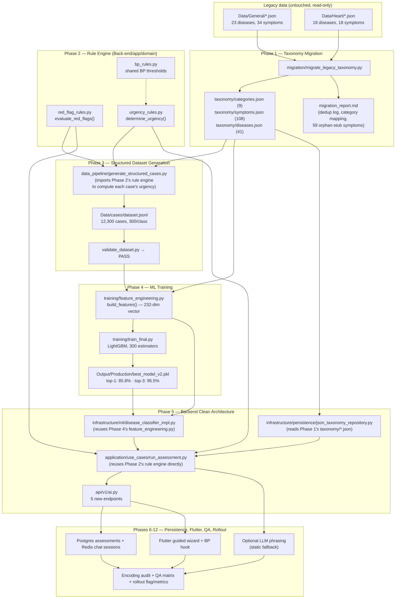
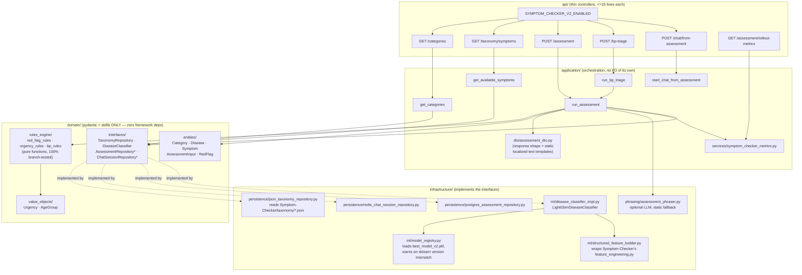
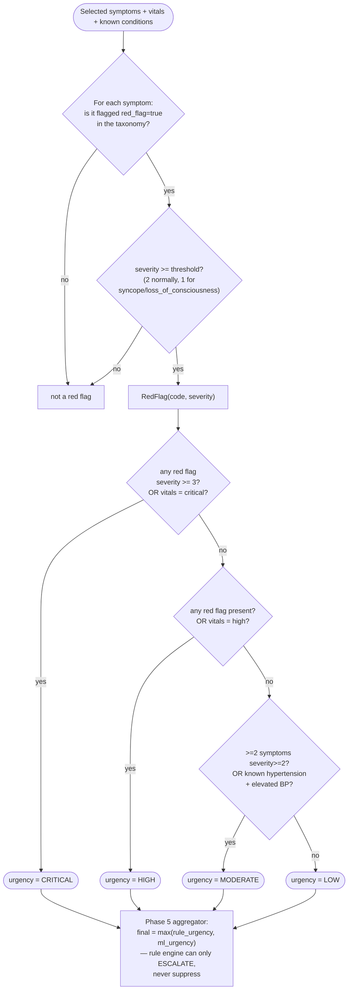
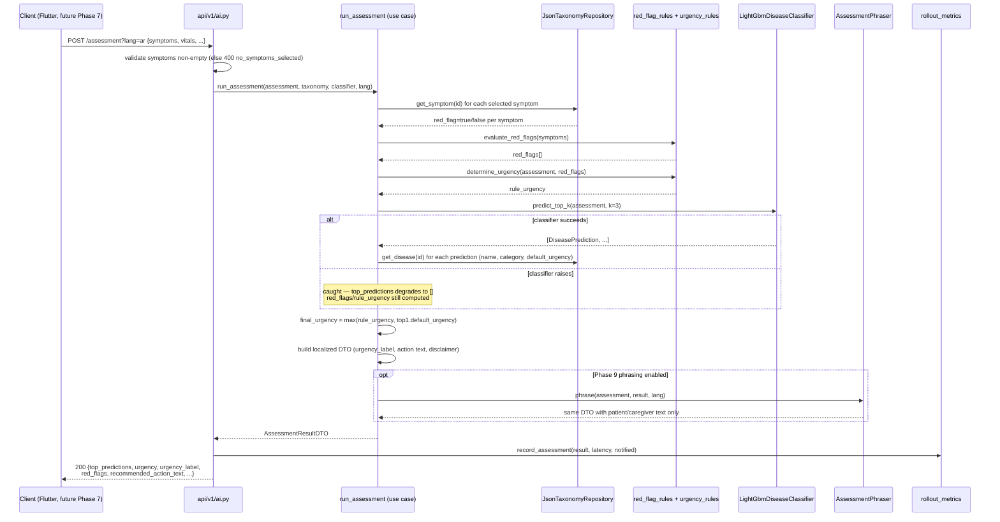
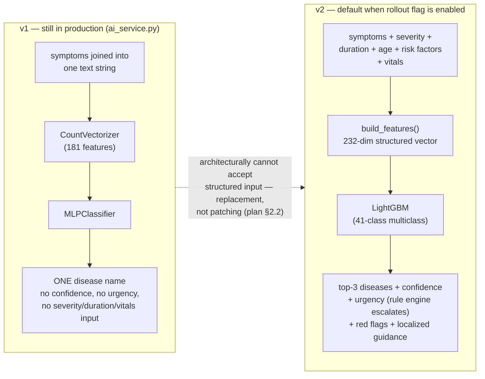

# Symptom Checker v2 — Architecture & Flow Diagrams

Documentation/presentation support for `Plans/SYMPTOM_CHECKER_IMPLEMENTATION_PLAN.md` +
`Plans/SYMPTOM_CHECKER_PROGRESS.md`. All diagrams are Mermaid (renders natively in VS Code
preview, GitHub, and most modern markdown viewers — no external tool needed). Chart images
(PNG, real numbers from the actual artifacts) are in
`Symptom-Checker/Output/Production/analysis/`, indexed in that folder's `analysis_index.md`.

---

## 1. End-to-end pipeline (Phases 1-12, what actually got built)



**Key point for the writeup:** the rule engine (Phase 2) and the feature engineering module
(Phase 4) are each a *single implementation* consumed by two different phases — Phase 3's
dataset generator and Phase 5's live backend both import the exact same
`red_flag_rules.py`/`urgency_rules.py`/`feature_engineering.py`, so the synthetic training
labels and the production decision logic can never drift apart.

---

## 2. Clean Architecture layers (Back-end, Phase 5)



**Dependency rule enforced throughout:** arrows only point *inward* — `domain/` never imports
from `application/` or `infrastructure/`; `infrastructure/` implements `domain/interfaces/` but
`domain/` has no idea `infrastructure/` exists. This is what makes the rule engine's 100%
branch-coverage test suite possible without a database or FastAPI running at all.

---

## 3. Red-flag + urgency decision flow (Phase 2, the safety-critical piece)



Verified end-to-end examples from the actual test suite / real container run:
- `chest_pain`(severity 3) + `shortness_of_breath`(severity 2) → **critical** (13/13 contract tests, real model)
- `syncope`(severity 1) alone → **high** ("fainting = emergency" scenario)
- `sudden_numbness` + `trouble_speaking` + `loss_of_balance` (all severity >=3) → **critical** ("stroke symptoms" scenario)

---

## 4. `POST /assessment` request flow (Phase 5, sequence diagram)



---

## 5. v1 vs v2 symptom checker — what changed and why



---

## 6. Where each phase's real numbers live (for the writeup/slides)

| Phase | Chart(s) | Report |
|---|---|---|
| 1 — Migration | `analysis/01_taxonomy_before_after.png`, `02_diseases_per_category.png` | `Symptom-Checker/migration/migration_report.md` |
| 2 — Rule engine | (diagram 3 above) | 43 pytest tests, 100% branch coverage — `Back-end/tests/domain/rules_engine/` |
| 3 — Dataset | `analysis/03_dataset_class_balance.png`, `04_urgency_distribution.png` | `Symptom-Checker/Data/cases/dataset_report.md` |
| 4 — Training | `analysis/05_model_comparison.png` through `09_covid19_share_check.png` | `Symptom-Checker/Output/Production/evaluation_report_v2.md` |
| 5 — Backend | (diagrams 2 and 4 above) | 13 pytest contract tests — `Back-end/tests/api/v1/test_assessment_endpoints.py`; real Docker container run logged in `Plans/SYMPTOM_CHECKER_PROGRESS.md` |
| 6-8 — Persistence/Flutter/BP | (diagrams 2 and 4 above) | `Back-end/tests/api/v1/test_assessment_endpoints.py`, `Front-end/health_mate_app/test/widget_test.dart` |
| 9-12 — Phrasing/QA/Rollout | (diagrams 1, 2, and 4 above) | `Back-end/tests/application/test_assessment_phrasing.py`, `Back-end/tests/quality/test_encoding_audit.py`, `Back-end/tests/services/test_ai_service_phrase_extraction.py`, rollout tests in `test_assessment_endpoints.py` |

Regenerate all PNG charts any time the taxonomy/dataset/model changes:
```bash
cd Symptom-Checker
python analysis/generate_visualizations.py
```
